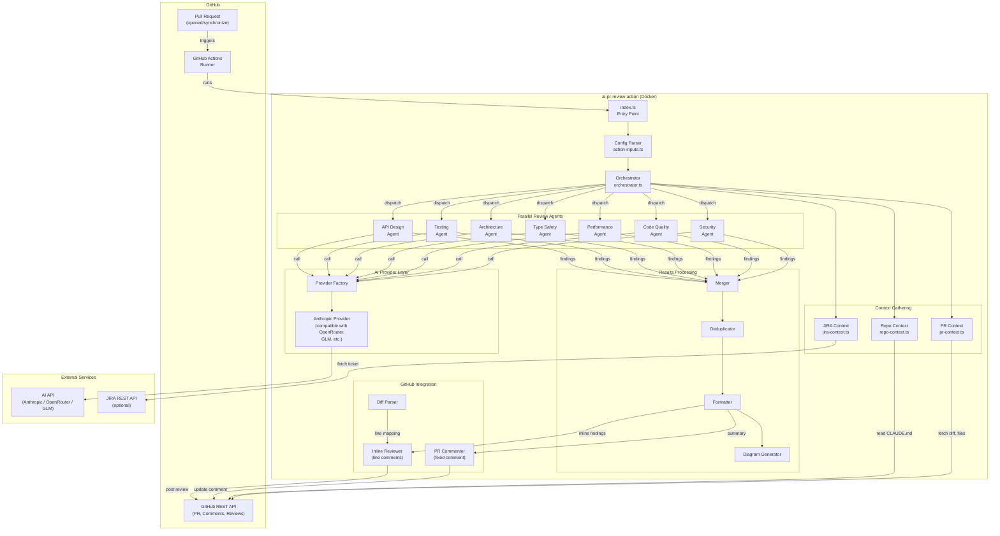
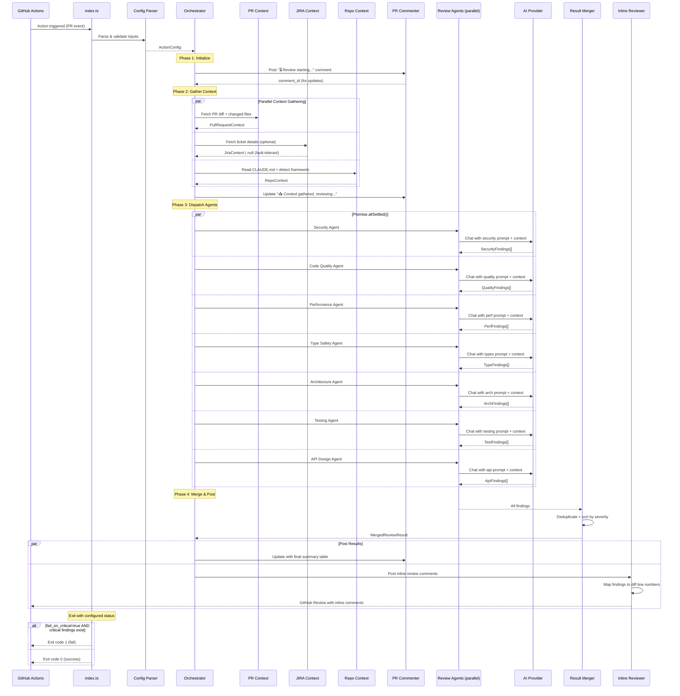
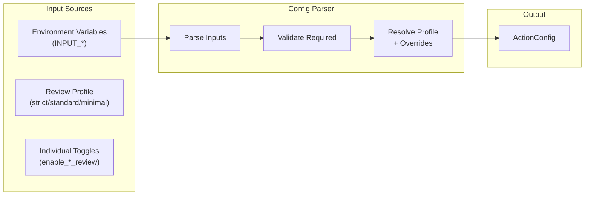
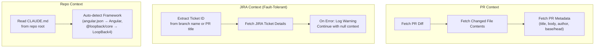
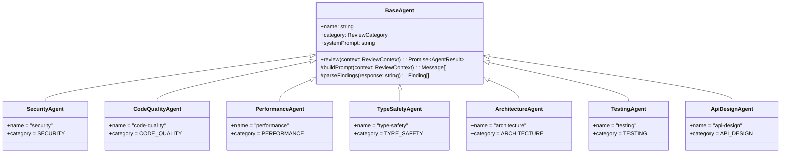
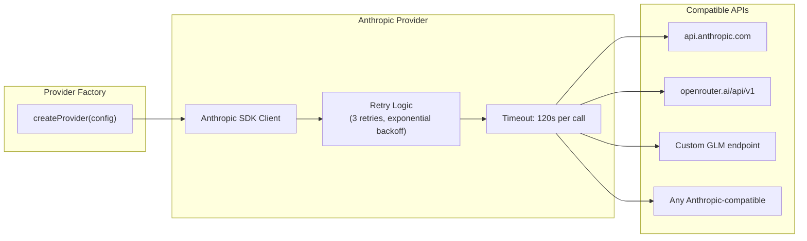
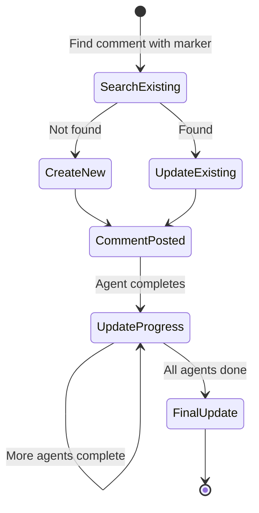
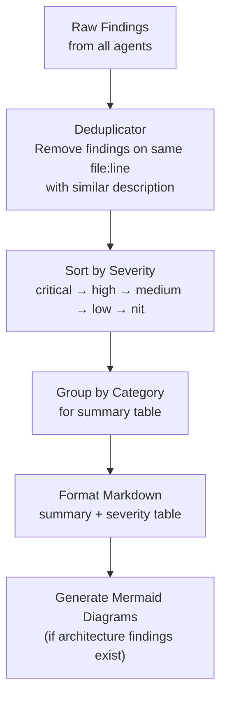
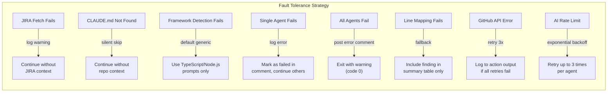

# AI PR Review Action — Architecture Document

## 1. Overview

**`sourcefuse/ai-pr-review-action`** is a GitHub Action that performs comprehensive, AI-powered code reviews on pull requests. It launches parallel specialist review agents — each focused on a specific quality dimension — and merges their findings into a single, structured PR comment with inline code annotations.

### Key Design Principles

- **Fault-tolerant**: No optional feature failure (JIRA, CLAUDE.md, individual agent) crashes the action
- **Highly configurable**: Profiles + individual toggles + prompt overrides at every level
- **Provider-agnostic**: Works with Anthropic, OpenRouter, GLM, or any Anthropic-compatible API
- **Drop-in simplicity**: 3 lines of config for a full review; sensible defaults for everything else
- **Company-wide standard**: Designed for org-level adoption across Angular & LoopBack4 projects

---

## 2. High-Level Architecture



---

## 3. Execution Flow



---

## 4. Component Details

### 4.1 Config Parser (`src/config/action-inputs.ts`)

Reads all action inputs and produces a validated `ActionConfig` object.



**Profile Resolution Logic:**

| Profile | Security | Quality | Performance | Types | Architecture | Testing | API Design |
|---------|----------|---------|-------------|-------|-------------|---------|------------|
| strict  | ✅ | ✅ | ✅ | ✅ | ✅ | ✅ | ✅ |
| standard | ✅ | ✅ | ✅ | ✅ | ✅ | ❌ | ❌ |
| minimal | ✅ | ✅ | ❌ | ❌ | ❌ | ❌ | ❌ |

Individual toggles (`enable_*_review`) override the profile setting for that dimension.

### 4.2 Context Gathering



**JIRA Ticket ID Extraction** (from branch name or PR title):
- Pattern: `([A-Z]{2,10}-\d+)` matches `PLM-1234`, `PROJ-567`, etc.
- Sources checked in order: branch name → PR title → PR body
- If not found: skip JIRA context silently

**Framework Auto-Detection:**
1. Check for `angular.json` or `nx.json` with Angular projects → Angular
2. Check `package.json` for `@loopback/core` dependency → LoopBack4
3. Check both → apply both Angular and LoopBack4 prompts
4. Neither found → use generic TypeScript/Node.js prompts

### 4.3 Review Agents

Each agent extends `BaseAgent` and has:
- A specialized system prompt (from `prompts/` directory)
- Framework-specific additions (Angular/LoopBack4) appended automatically
- User overrides (system_prompt_append, framework-specific appends) applied last
- CLAUDE.md content injected into context



**Agent Response Format** (structured JSON from AI):

```json
{
  "findings": [
    {
      "severity": "critical|high|medium|low|nit",
      "category": "security|quality|performance|...",
      "file": "src/auth.service.ts",
      "line": 42,
      "title": "SQL injection vulnerability",
      "description": "User input directly interpolated into SQL query",
      "suggestion": "Use parameterized queries: `await this.db.execute($1, [userInput])`",
      "code_suggestion": "const result = await this.db.execute('SELECT * FROM users WHERE id = $1', [userId]);"
    }
  ],
  "summary": "Found 3 security issues: 1 critical SQL injection, ...",
  "score": 6
}
```

### 4.4 AI Provider Layer



The provider uses the official `@anthropic-ai/sdk` with configurable `baseURL` — this automatically supports any Anthropic-compatible API.

### 4.5 GitHub Integration

**PR Commenter (Fixed Comment Pattern):**



The comment contains a hidden HTML marker to identify it:
```html
<!-- ai-pr-review-action-comment -->
```

**Inline Review Comments:**

Uses GitHub's Pull Request Review API to post inline comments on specific diff lines:
1. Parse the PR diff to build a line-number-to-diff-position map
2. For each finding with a file + line, look up the diff position
3. If the line is within a diff hunk, post an inline comment
4. If not in a diff hunk, include the finding in the summary comment only
5. Submit all inline comments as a single review (not individual comments)

### 4.6 Results Processing



---

## 5. Fault Tolerance Matrix



---

## 6. Configuration Hierarchy

```mermaid
flowchart TD
    subgraph "Priority (highest to lowest)"
        P1["1. Action Inputs<br/>(workflow YAML)"]
        P2["2. CLAUDE.md<br/>(from target repo)"]
        P3["3. Review Profile<br/>(strict/standard/minimal)"]
        P4["4. Built-in Defaults<br/>(hardcoded in action)"]
    end

    P1 --> P2 --> P3 --> P4

    subgraph "Prompt Assembly"
        BASE["Base System Prompt"]
        AGENT["Agent-Specific Prompt"]
        FW["Framework Prompt<br/>(Angular / LoopBack4)"]
        CLAUDE_MD["CLAUDE.md Content"]
        JIRA_CTX["JIRA Ticket Context"]
        USER_APPEND["User system_prompt_append"]
        FW_APPEND["User framework_prompt_append"]
        
        BASE --> AGENT --> FW --> CLAUDE_MD --> JIRA_CTX --> USER_APPEND --> FW_APPEND
    end
```



---

## 7. Review Dimensions

### Security Agent
- OWASP Top 10 vulnerabilities
- Injection attacks (SQL, NoSQL, command, XSS, template)
- Hardcoded secrets/credentials
- Authentication & authorization flaws
- CSRF, CORS misconfiguration
- Prototype pollution (Node.js specific)
- Insecure deserialization
- Sensitive data in logs
- Missing input validation at boundaries
- Dependency vulnerabilities (known CVE patterns)

### Code Quality Agent
- SOLID principles violations (SRP, OCP, LSP, ISP, DIP)
- DRY violations (duplicated logic)
- KISS violations (overcomplicated solutions)
- Cyclomatic & cognitive complexity
- Naming conventions and consistency
- Dead code, unused imports
- Magic numbers/strings
- File size and function length
- Error typing (HttpErrors vs plain Error)
- Function parameter count (max 5)
- Inline return types (enforce DTOs)
- Code simplification opportunities

### Performance Agent
- N+1 query patterns
- Memory leaks (event listeners, subscriptions, timers)
- Blocking operations in async context
- Missing pagination on collections
- Unbounded loops
- Redundant computations in hot paths
- Missing caching opportunities
- Large payloads without streaming
- Observable/subscription cleanup (Angular)

### Type Safety & Documentation Agent
- Missing return types on functions
- Missing parameter types (implicit `any`)
- Loose types (`any`, `object`, `Function`)
- Missing JSDoc/TSDoc on all functions
- Missing `@param` and `@returns` documentation
- Incorrect/outdated comments
- Missing model & property descriptions (LoopBack4)
- Inline response schemas (enforce DTOs)

### Architecture Agent
- Layering violations (controller ↔ repository direct access)
- Dependency injection issues
- Circular dependencies
- Missing abstractions / over-abstraction
- Separation of concerns violations
- Configuration hardcoding
- Angular: Change detection strategy, module structure, lazy loading
- LoopBack4: Decorator usage, repository patterns, interceptors

### Testing Agent
- Missing test coverage for new code paths
- Missing edge case tests (empty, null, boundary)
- Mock quality (do mocks match real implementations?)
- Test naming clarity
- Async test handling
- Snapshot test overuse
- Test isolation (no interdependencies)

### API Design Agent
- HTTP method correctness
- Status code appropriateness
- URL naming conventions
- Input validation at boundaries
- Pagination implementation
- Response format consistency
- Breaking API changes
- OpenAPI spec accuracy
- Error response format

---

## 8. Versioning Strategy

- **Tags**: `v1.0.0`, `v1.1.0`, `v2.0.0` — semantic versioning
- **Major tag**: `v1` — always points to latest v1.x.x (for consumer stability)
- **Docker image**: Published to GHCR on each release tag
- **Breaking changes**: Major version bump only

Consumer usage: `sourcefuse/ai-pr-review-action@v1` — always gets latest v1.x patches.

---

## 9. Technology Stack

| Component | Technology |
|-----------|------------|
| Runtime | Node.js 20 (inside Docker) |
| Language | TypeScript 5.x |
| AI SDK | @anthropic-ai/sdk |
| GitHub SDK | @actions/core, @actions/github, @octokit/rest |
| HTTP Client | Built-in fetch (Node 20) |
| Testing | Jest |
| Linting | ESLint + typescript-eslint |
| Container | Docker (Alpine-based Node 20) |
| CI/CD | GitHub Actions |

---

## 10. Security Considerations

- **No secrets stored**: All credentials passed via action inputs (encrypted GitHub Secrets)
- **Minimal permissions**: Only `contents: read` and `pull-requests: write` required
- **No external data exfil**: Only communicates with configured AI API and GitHub API
- **Diff-only context**: Only changed files sent to AI, not entire repo
- **Token scoping**: GITHUB_TOKEN automatically scoped to the repo
