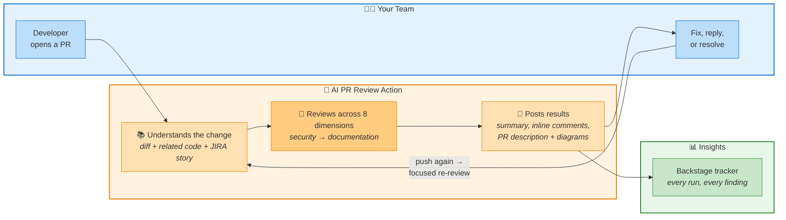
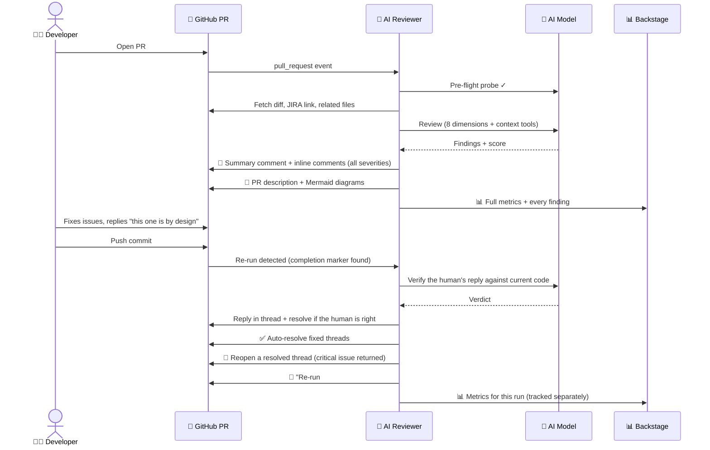

# 🤖 AI PR Review Action

**Every pull request reviewed in minutes — deeply, consistently, and without adding a single reviewer to your team.**

A Docker-based GitHub Action that reads your PR the way a senior engineer would: it understands the change, pulls in the surrounding code, checks the JIRA story, reviews across 8 quality dimensions, and posts everything back as clean, actionable PR comments. Then — and this is the part reviewers love — it *remembers* what it already said, so re-reviews stay focused instead of nagging.

---

## Why it exists

| The pain | What this action does about it |
|----------|-------------------------------|
| Reviews wait hours or days | First feedback lands minutes after the PR opens |
| Review quality depends on who reviews | The same 8-dimension checklist runs on every PR, every time |
| "Fix 10 comments → get 5 new nitpicks" loops | Re-runs post only critical/high issues; the noise stops |
| Reviewers lack context beyond the diff | The action fetches related files, resolves imports, and can even *look things up itself* |
| No visibility into review activity | Every run reports full metrics — findings, activity, tokens, cost — to your dashboard |

---

## The big picture



---

## 🚀 The first run — the full treatment

When a PR gets its first AI review, the action does **all** of this, in order:

1. **Pre-flight check** — probes the AI endpoint before touching the PR, so a down provider produces a clear message instead of a half-done review. It also watches the PR: if someone closes or merges it mid-review, the run cancels gracefully and frees the runner.
2. **Bot noise cleanup** — minimizes recurring bot chatter (SonarQube reposts, stale report comments), keeping only the latest of each so humans see signal, not scroll.
3. **Understands the change**
   - Collects changed files, honoring your include/exclude patterns (lock files, migrations, `dist/`, etc. are excluded by default).
   - Pulls the **JIRA story** from the branch name or PR title — summary, status, acceptance criteria — so the review knows *what the change is supposed to do*.
   - Builds **related context**: a shallow clone of the PR head plus compiler-exact import resolution (TypeScript path aliases, npm workspaces, barrel re-exports) and framework smarts — Angular sibling templates/styles/modules, LoopBack4 dependency-injection bindings. The reviewer sees the code *around* the diff, not just the diff.
   - **Agentic context tools**: if the model still needs something, it can call `read_file`, `grep`, `find_references`, or `list_dir` against the checkout itself — hard-capped at 12 tool calls per run so it stays fast and cheap.
4. **Reviews across 8 dimensions** — 🔒 Security, ✨ Code Quality, ⚡ Performance, 🛡️ Type Safety, 🏛️ Architecture, 🧪 Testing, 🔌 API Design, 📖 Documentation. One comprehensive pass by default (`combined` mode), or 8 parallel specialist agents (`separate` mode) if you prefer.
5. **Consolidates** — two dedup passes (programmatic similarity matching, then AI semantic merge in separate mode) so you never see the same issue twice.
6. **Posts the summary comment** — one fixed comment per PR, updated in place (old ones are minimized, never deleted). Includes pass/fail status, a Critical & High table, all findings collapsed, JIRA context, agent scores, strengths, and the full **Tracking Metrics** block.
7. **Answers your developers** — if a human replied to any earlier review thread ("this is by design", "fixed in the service layer"), the AI **verifies the claim against the current code** and replies: agreeing and resolving the thread, or explaining precisely why the issue still stands.
8. **Resolves what's fixed** — threads from previous reviews whose issue no longer exists are auto-resolved (never touching threads where a human is waiting for an answer).
9. **Inline comments** — every finding, **every severity**, posted on the exact diff line, many with one-click committable code suggestions. Never on test files, never duplicated across runs.
10. **Writes the PR description** — an AI summary appended below your own text (never overwriting it), plus **Mermaid architecture/flow diagrams** validated before posting so they always render.
11. **Reports everything** — 23 action outputs, a GitHub job summary, and (if configured) a full JSON payload to your Backstage tracker — aggregates *and* every individual finding.

## 🔁 Re-runs — where it gets smart

The moment a review completes, the summary comment carries a hidden completion marker. Every later push triggers a re-run that *knows it's a re-run* (title becomes **"AI Code Review — Re-run #N"**) and behaves differently:

| Behavior | First run | Re-run |
|----------|-----------|--------|
| Findings detected & counted | All severities | All severities (totals stay honest) |
| **New** inline comments | All severities | **Critical & High only** — plus documentation suggestions (paste-ready JSDoc) |
| Fixed issues | — | Threads auto-resolved ✅ |
| Regressed issues | — | Resolved threads **reopened** if their critical/high issue is back — with a templated explanation, never after a human justification was accepted |
| Human replies | Verified & answered | Verified & answered |
| PR description & diagrams | Generated | **Kept as-is** (saves 2 AI calls, no churn) |

Result: developers fix what matters, push, and get a *quieter* review each time — while the summary still shows the complete picture. (Set `enable_rerun_focus: false` to get full first-run behavior every time.)

---

## 🎬 The review lifecycle



---

## 📊 Every metric it captures

All of these appear in the summary comment's **Tracking Metrics** block, as **action outputs** for downstream workflow steps, and in the **Backstage payload**:

**Findings** — total, by severity (critical / high / medium / low / nit) and by category (all 8), average agent score, pass/fail against your threshold.

**Review activity (per run)** — new inline comments, carried-over comments, threads resolved as fixed, threads reopened, replies posted, threads resolved from replies, bot comments hidden.

**AI usage (per run)** — AI calls made, input tokens, output tokens, and an **estimated cost in USD** (when you supply `model_pricing` — a client-side estimate from token counts, never billing data).

**Run health** — status (`completed` / `skipped` / `failed`) with a machine-readable skip reason, duration, agents run, agents failed, summary comment ID/URL.

Every run — including skips and failures — is POSTed to the tracker as its own row, so re-reviews of a PR are tracked individually and nothing goes missing.

<details>
<summary><strong>Full action outputs list (23)</strong></summary>

`review_status`, `skip_reason`, `total_findings`, `critical_count`, `high_count`, `medium_count`, `low_count`, `nit_count`, `review_passed`, `duration_seconds`, `agents_run`, `agents_failed`, `ai_calls`, `input_tokens`, `output_tokens`, `estimated_cost_usd`, `review_comment_id`, `review_comment_url`, `replies_posted`, `threads_resolved_from_replies`, `threads_reopened`, `bot_comments_hidden`, `backstage_reported`.

</details>

---

## 🛡️ Built to never block you

- **Fault-tolerant by design** — best-effort work (inline comments, diagrams, replies, metrics) warns and continues; only genuinely critical failures fail the run, and even then a clear failure comment and a Backstage `failed` report go out first.
- **Non-blocking by default** — `fail_on_critical` is off; the review informs, it doesn't gate. Flip it on (with your chosen `fail_threshold`) when you're ready to enforce.
- **Provider-resilient** — a comma-separated **model fallback chain**, patient rate-limit retries (rides out throttling spells for hours if needed), streaming heartbeats, auto-discovered output caps, and automatic thinking-mode fallback. Works with **Anthropic, z.ai/GLM, OpenRouter, OpenAI, or any compatible endpoint**.
- **Secret-safe** — tokens are masked in logs at parse time; only presence is ever logged.
- **Big-PR aware** — skips PRs above `max_files_to_review` with a friendly explanation instead of a timeout, and trims prompts to the model's context window automatically.

---

## ⚡ Get started in 2 minutes

Drop this into `.github/workflows/ai-code-review.yml` — **two secrets, zero other setup** (`GITHUB_TOKEN` is provided automatically; the org-level `ANTHROPIC_AUTH_TOKEN` is already available to SourceFuse repos):

```yaml
name: AI Code Review

on:
  pull_request:
    types: [opened, synchronize, reopened]

permissions:
  contents: write      # needed to resolve/unresolve review threads
  pull-requests: write

jobs:
  review:
    runs-on: ubuntu-latest
    steps:
      - uses: sourcefuse/ai-pr-review-action@v1
        with:
          github_token: ${{ secrets.GITHUB_TOKEN }}
          anthropic_auth_token: ${{ secrets.ANTHROPIC_AUTH_TOKEN }}
```

> ⚠️ `contents: write` matters: GitHub requires push access to resolve/unresolve PR conversations. With `contents: read`, fixed findings' threads stay open forever — the action will warn you about exactly this.

That's it. Everything below is optional tuning.

---

## 🧰 The complete options reference

Every input, grouped as in `action.yml`. Bold = the ones teams most commonly touch.

### Required

| Input | Default | What it does |
|-------|---------|--------------|
| **`github_token`** | — | GitHub token for PR access (usually `secrets.GITHUB_TOKEN`) |
| **`anthropic_auth_token`** | — | API key for the AI endpoint (Anthropic, z.ai/GLM, OpenRouter, OpenAI…) |

### Provider configuration

| Input | Default | What it does |
|-------|---------|--------------|
| `ai_provider` | `anthropic` | API dialect: `anthropic` (Anthropic-compatible) or `openai` (any `/chat/completions` endpoint) |
| `anthropic_base_url` | `https://api.anthropic.com` | AI endpoint URL — point it at z.ai, OpenRouter, or a custom server |
| **`anthropic_model`** | `glm-5.2` | Model id, or a comma-separated **fallback chain** tried in order |
| `model_pricing` | *(empty)* | `model=input/output` USD-per-million-token pairs → enables the cost estimate |
| `max_tokens` | `0` (auto) | Output cap; auto mode uses the model's full native capacity so reviews are never truncated |
| `thinking_budget` | `4096` | Extended-thinking token budget; `0` disables thinking |
| `context_window` | `1000000` | Model's context size — prompts are trimmed to fit automatically |
| `temperature` | `0.2` | AI temperature (0.0–1.0) |

### Review mode

| Input | Default | What it does |
|-------|---------|--------------|
| **`review_mode`** | `combined` | `combined` = one comprehensive review; `separate` = 8 parallel specialist agents |
| `review_profile` | `standard` | Separate mode intensity: `strict` (8 agents), `standard` (6), `minimal` (2) |
| `enable_<dimension>_review` ×8 | *(follow profile)* | Per-agent override in separate mode: `security`, `code_quality`, `performance`, `type_safety`, `architecture`, `testing`, `api_design`, `documentation` |

### Context & framework

| Input | Default | What it does |
|-------|---------|--------------|
| `related_context` | `full` | Unchanged-file context: `full` (import graph + aliases + workspaces + barrels + framework expansion), `imports-only`, or `off` |
| `enable_context_tools` | `true` | Lets the model fetch missing context itself (read_file/grep/find_references/list_dir) — hard-capped at 12 calls per run |
| `framework` | `auto` | Framework prompt additions: `angular`, `loopback4`, `both`, `generic`, or auto-detect |

### JIRA integration (optional, fault-tolerant)

| Input | Default | What it does |
|-------|---------|--------------|
| `jira_url` / `jira_email` / `jira_api_token` | *(empty)* | JIRA instance + API credentials |
| `jira_project_key` | *(empty)* | Project key (e.g. `PLM`) for ticket detection from branch/PR title |

### Behavior flags

| Input | Default | What it does |
|-------|---------|--------------|
| **`fail_on_critical`** | `false` | Fail the check when findings at/above `fail_threshold` exist |
| `fail_threshold` | `critical` | Minimum severity that fails: `critical`, `high`, `medium` |
| `post_inline_comments` | `true` | Post per-line review comments on the diff |
| **`post_data_url`** | *(empty)* | Backstage/webhook endpoint — POSTs metrics + every finding after each run (fire-and-forget) |
| `enable_reply_handling` | `true` | Verify human replies against the code, answer them, resolve valid ones |
| `enable_rerun_focus` | `true` | The re-run behavior described above; disable for full reviews every run |
| `enable_bot_comment_cleanup` | `true` | Minimize noisy recurring bot comments |
| `max_files_to_review` | `50` | Skip (don't fail) PRs larger than this |
| `exclude_patterns` | *(empty)* | Extra glob excludes — **appended** to sensible built-in defaults |
| `include_patterns` | *(empty)* | If set, only these globs are reviewed |
| `pr_number` | *(auto)* | Review a specific PR (defaults to the triggering event's PR) |

### Prompt & comment customization

| Input | Default | What it does |
|-------|---------|--------------|
| `system_prompt_override` | *(empty)* | Replace the entire built-in system prompt |
| `system_prompt_append` | *(empty)* | Add org/team rules on top of the built-in prompts |
| `angular_prompt_append` / `loopback4_prompt_append` | *(empty)* | Framework-specific extra instructions |
| `comment_header` / `comment_footer` | `AI Code Review` / *(empty)* | Customize the summary comment's title and footer |

### Diagrams & advanced

| Input | Default | What it does |
|-------|---------|--------------|
| `enable_diagrams` | `true` | AI Mermaid diagrams in the PR description (validated before posting) |
| `agent_timeout` | `800` | Per-AI-call timeout (seconds) — progress-aware: a still-streaming call isn't killed |
| `max_retries` | `3` | Retries per transient API failure (429s retry on their own patient budget) |
| `cancel_on_pr_close` | `true` | Cancel gracefully (not fail) if the PR closes mid-review |
| `debug` | `false` | Verbose logging |

### Popular recipes

```yaml
# Quality gate: block merges on high-severity issues
fail_on_critical: 'true'
fail_threshold: 'high'

# Deep-dive mode: 8 specialist agents instead of one pass
review_mode: 'separate'
review_profile: 'strict'

# Org dashboard + cost tracking
post_data_url: 'https://backstage.example.com/api/ai-reviews'
model_pricing: 'glm-5.2=0.6/2.2'

# House rules
system_prompt_append: 'Flag any use of moment.js — we migrated to date-fns.'
```

More complete examples live in [`examples/`](../examples): basic usage, Angular, LoopBack4, OpenRouter, full config.

---

## 💬 Working with the reviewer (and telling us what you think)

**Talk to it like a colleague.** Reply directly in any inline comment thread — "this is intentional because X", "fixed in the service layer", or just ask a question. On the next run the AI reads your reply, checks the **current code**, and answers: it concedes and resolves the thread when you're right, and explains exactly why (with line references) when the issue still stands. An accepted justification is final — the bot never reopens a thread a human has justified.

**Let it manage the thread lifecycle.** Fix the code and push — fixed threads resolve themselves; nothing to click. Threads you resolve manually stay resolved unless a critical/high issue genuinely returns.

**Wrong or noisy finding?** That's exactly the feedback we want:
- Reply in the thread (it doubles as a record we can review),
- Open an issue on the action repo with the PR link and the finding, or
- Ping the platform team — prompt tuning, new exclude defaults, and org-wide house rules (`system_prompt_append`) all come from this feedback.

Adopting it in your repo is one small PR. Every review after that is free attention for your team — start with the 2-minute setup above and let the bot take the first pass. 🚀
